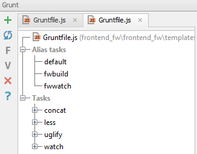
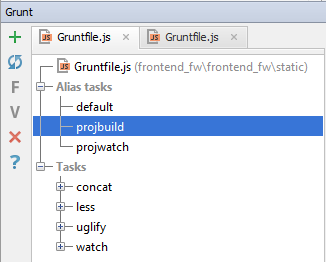
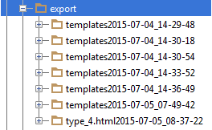
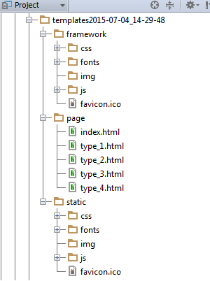
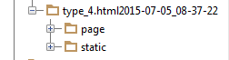
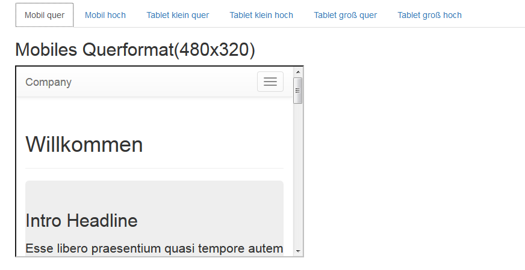

# Baukasten für Frontend Entwicklung

## Idee
Frontend Entwickler sowie Composer einer Frontendabteilung sollen bei der schnellen Erstellung statischer HTML-Vorlagen unterstützt werden.

Die Abteilung setzt IntelliJ unter MacOS ein, einige der Entwickler kennen sich mit Datenbanken und serverseitiger Programmierung nicht aus, sollen aber trotzdem in der Lage sein, einige Anpassungen an dem Baukasten vorzunehmen

## technische Voraussetzungen
* OS X 10.9 Mavericks or OS X 10.10 Yosemite
* IntelliJ Idea IDE
* Python 2.7
* Pip
* Node.js
* npm
* Virtualenv

## verwendete Technologien
* Django ohne Datenbankanbindung (Verzicht auf Models)
* Grunt
* LESS
* fabric
* webkit2png (nur MacOS!)
* Shell Skript

## Funktionsumfangs
- übersichtliche Darstellung des aktuellen Entwicklungstands
	- in Arbeit
	- fertig gestellt
- Templatefunktionalität: Redundanzen vermeiden, templateübergreifende Seitenelemente als Includes ablegen, um Änderungen schneller umsetzen zu können
- automatisch erzeugte, aber konfigurierbare Vorlagenlisten für den Templatestand
- übersichtliche Möglichkeit, responsive Layouts zu testen
- wahlweise automatisches oder manuelles Kompilieren von LESS-Dateien
- wahlweise automatisches oder manuelles Konkatinieren von JS-Dateien
- Export von minifizierten JS- und CSS-Dateien
- Export von Entwicklungsständen mit der Möglichkeit, Vorlagen auszunehmen mit automatisch erzeugter Vorlagenliste
- Export von einzelnen Templates ohne Vorlagenliste
- gleichzeitige Erstellung von mehreren Screenshots eines Templates

## Bedienungsanleitung

### Erstellung von HTML-Vorlagen
Für HTML-Vorlagen gelten die folgenden Regeln:

- Ablageort: im Ordner /frontend_fw/frontend_fw/templates/page
- Benamungsschema:
	- 'type_laufendeNummer.html' für Seitentypen
	- 'type_laufendeNummerSuffixKleinbuchstaben.html' für Variationen oder kontextuell zusammenhängende Vorlagen

- Template Language: Django Template bietet eine Reihe von Build-in Tags und Filter
- Includes: Snippets werden unter frontend_fw/frontend_fw/templates/_meta/blocks/ abgelegt
	- 'proj' Snippets für das Kundenprojekt, es können auch weitere Unterordner angelegt werden
	- 'fw' Snippets für den Frontend Baukasten

### CSS, Javascript und statische Dateien

Das Frontend für Baukasten und Kundenprojekt sind streng getrennt, daher gibt es für den Baukasten und das Kundenprojekt auch getrennte static Verzeichnisse:

- '\frontend_fw\frontend_fw\templates\static' für den Baukasten

- '\frontend_fw\frontend_fw\static' für das Kundenprojekt

#### img und imgfw

Im static Verzeichnis für den Baukasten gibt es zwei verschiedene Ordner für Bilder. Alle Dateien, die unter 'img' werden im Bundle Export erfasst, Bilder in 'fwimg' sind nur für die lokale Entwicklung gedacht.

#### Grunt
Die Konkatination von JavaScript Modulen und das Kompilieren von LESS-Dateien erfolgt über Grunt

In der Grunt Konsole von IntelliJ können die folgenden Alias Tasks verwendet werden:

##### Baukasten

- default: Alle Skripte werden konkatiniert, LESS wird kompiliert und konkatiniert.
- fwbuild: Alle Skripte werden konkatiniert,minifiziert und 'uglified', LESS wird kompiliert, konkatiniert und minifiziert. Zusätzlich werden die erzeugten Dateien unter 'frontend_fw\src' getrennt nach CSS und JS abgelegt.
- fwwatch: Der Default-Task wird automatisch bei jeder Änderung in einer JS oder LESS Datei ausgeführt

##### Kundenprojekt

- default: Alle Skripte werden konkatiniert, LESS wird kompiliert und konkatiniert.
- projbuild: Alle Skripte werden konkatiniert,minifiziert und 'uglified', LESS wird kompiliert, konkatiniert und minifiziert. Zusätzlich werden die erzeugten Dateien unter 'frontend_fw\src' getrennt nach CSS und JS abgelegt.
- projwatch: Der Default-Task wird automatisch bei jeder Änderung in einer JS oder LESS Datei ausgeführt

### Bundle Export von HTML-Vorlagen

Auf der Vorlagenübersicht befindet sich der Button 'Bundle exportieren'

Nach Auslösen des Buttons werden automatisch alle konfigurierten HTML-Vorlagen inklusive der statischen Dateien als statischs HTML im Ordner 'frontend_fw\export' abgelegt.

#### Aufbau des Exports

Jeder Export erhält einen eigenen Ordner 'templates[Zeitstempel des Exports]'

Die Ordnerstruktur ist die folgende:

- framework: enhält die statischen Dateien des Baukastens (genutzt für die Templateübersichtsseite)
- page: enthält die Templateübersichtsseite sowie alle Kundentemplates
- static: enthält die statischen Dateien für das Kundenprojekt

#### Konfiguration des Exports
Die Konfiguration erfolgt in 'frontend_fw\core\templatesettings.py'

- PAGE_LIST: Aufbau des Indexabschnitts fertige Vorlagen, es können beliebig viele Unterabschnitte angelegt werden.
- PAGE_WORK_LIST: Aufbau des Indexabschnitts Vorlagen in Arbeit, es können beliebig viele Unterabschnitte angelegt werden.
- BUILD_PAGE_EXCLUDED:Vorlagen, die nicht exportiert werden sollen

Der Export Prozess erfasst standardmäßig alle im Templateordner 'page' vorhandenen Vorlagen, mittels BUILD_PAGE_EXCLUDED können Ausnahmen definiert werden.

Vorsicht! BUILD_PAGE_EXCLUDED bezieht sich nur auf den Kopierprozess, nicht auf die Templateübersichtsseite

Um die Templateübersicht so flexibel wie möglich zu gestalten (Mehrfachnennung einer Vorlage in mehreren Abschnitten, Nichterfassen einer exportierten Vorlage...) wurden die Export und Übersicht entkoppelt. Der Frontendentwickler muss selbst darauf achten, dass in der Übersicht keine in BUILD_PAGE_EXCLUDED aufgeführten Vorlagen verlinkt sind.

### Einzelexport einer HTML-Vorlage

Jedes Template kann auch einzeln exportiert werden.

Einzelexports haben keine Konfiguration und werden ohne Templateübersichtsseite exportiert

#### Auslösen des Exports
Auf der Vorlagenübersicht befindet neben jeder Vorlage ein Export Link

Nach Auslösen des Links wird das Template im Browser angezeigt und automatisch inklusive der statischen Dateien als statischs HTML im Ordner 'frontend_fw\export' abgelegt.

#### Aufbau des Exports
Jeder Export erhält einen eigenen Ordner 'templatename[Zeitstempel des Exports]'

Die Ordnerstruktur ist die folgende:

- page: enthält das Kundentemplate
- static: enthält alle statischen Dateien für das Kundenprojekt, eine templatespezifische Auswahl findet nicht statt

### Responsive Ansichten

#### Anzeigen der Responsiven Ansichten
Auf der Vorlagenübersicht befindet neben jeder Vorlage ein Link Responsive

Folgt man dem Link, kommt man zu einer Tabansicht von Viewport Varianten

#### Konfiguration der Responsiven Ansichten
Die Konfiguration erfolgt in 'frontend_fw\core\templatesettings.py'

- IFRAME_LIST: beliebige Anzahl an Viewports konfigurierbar, Höhe, Breite und Benamung frei wählbar

### Automatisches Erstellen von Screenshots

Das Erstellen von Screenshots erfolgt über die IntelliJ Konsole mittels des Scripts 'frontend_fw\screens\screenshot.sh'

Dazu aktiviert man das virtual environment, wechselt in das 'screens' Verzeichnis und ruft das screenshot Skript mit den Argumenten Templatename und URL auf

#### Größe, Benamung und Anzahl der Screenshots

Es erstellt im screens Verzeichnis ganzseitige Screenshots in den Breiten 600, 768 und 320. Sind andere bzw. weitere Größen erwünscht, muss das Array in Zeile 3 des Scripts geändert werden.

Die erstellten Screenshots haben den Aufbau screenshot-templatename-'groesse.png

#### Argumente
Das Skript erwartet 2 Argumente: Templatename und die URL, unter der das Template aufgerufen werden soll

#### typische Fehlerquelle
Rechteproblem mit webkit2png.py bzw. screenshot.sh: beide müssen ausführbar sein